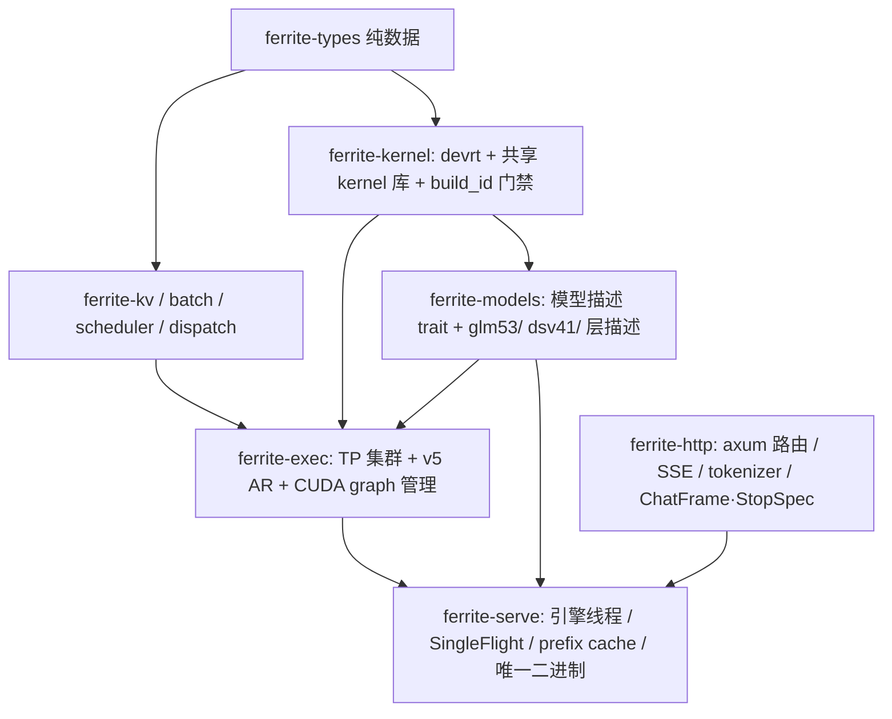

# Ferrite 统一推理引擎 — 最终架构蓝图

**一句话**：一个 engine、N 个模型。运行时（设备层 / 引擎契约 / serve 栈）全部共享；模型只保留「算子 + 层链 + 权重布局」，且这三者进一步下沉为**数据**（层描述列表）——数学差异由数据表达，不是代码分叉。

---

## 1. 分层图

箭头 = 依赖方向（基于各 `Cargo.toml` 实际边；`ferrite-dsv41` 为待删 shim）：



- **ferrite-kernel** —— 唯一设备层。`devrt`（dlopen、字节级不池化分配、H2D/D2D、捕获原语）+ `cuda.rs`（`CudaBackend`/Tensor）+ `dcp`（分页/稀疏注意力原语）+ `build.rs` 把 `.build_id` 烤进二进制，加载时与 `.so` 的 `ferrite_kernel_build_id()` 对拍，不匹配即拒载。
- **ferrite-models** —— **只放数据与描述**：`dsv41/`（config/weights/engram/quant/chain）、未来 `glm53/`。其 `device.rs`/`tp.rs` 通用内脏已转发 `devrt` / `ferrite_p2p_ar_v5`，剩余 DSV4 ABI 表随模型走，Phase 4 后删。
- **ferrite-exec** —— 引擎契约与集群：TP 集群、**AR v5 epoch 协议**（唯一活的 P2P 交换）、mega-graph 链、`StepEngine` 形状。
- **ferrite-serve / ferrite-http** —— 唯一二进制 `--model {glm53,dsv41}`；SingleFlight + prefix cache；模型差异只经 `StopSpec`（停词集）与 `ChatFrame`（chat 模板）注入，seam 已就绪。

## 2. 核心抽象

**模型 = 层描述列表**。`ferrite-model/src/layer.rs` 的 `LayerPlan{layer_idx, attn, mlp}` + `build_layer_plans()` 是雏形：层角色在 build 期决定，forward 期不再分叉。终态扩展为：

```rust
struct LayerDesc { kernels: &[KernelId], weights: &[WeightSpec], shard: ShardRule }
fn layer_descs(cfg) -> Vec<LayerDesc>
```

DSV4.1 的每层三段（A: hc→attn；**AR#1**；B: hc→moe；**AR#2**；C: hc_post）与 GLM 的 45 层 linear/DSA 混合，都只是不同的**描述数据**。

**引擎 = 图构建器**：`layer_descs` → 构造期预分配缓冲 → 捕获 CUDA graph 节点。所有 launch 参数必须**设备化**（`window_idxs`/`compress_commit`/`ring_append` 即为此生），图才能跨请求复用；当前 `reset` 丢 exec 是权宜，正解是构造期一次性分配、地址进程内稳定。

## 3. 迁移路线

| Phase | 内容 | 风险 | 验收 |
|---|---|---|---|
| 0 | build_id / argmax·gather·scatter / graph 原语统一（补丁已有）| 零 | 编译 + 四段文本 |
| 1 | 消灭 dsv41 的 `tp.rs`：改调 ferrite-exec 的 v5 AR + graph 管理（AR 换共享已完成，剩 engine 契约）| 低 | `ar_micro` 与 host 逐轮一致 |
| 2 | kernel 库合并：`dsv41_*.cu` 并入 `ferrite_kernels.cu`（或独立 `.so` 保留各自 build_id）| 中 | GLM 路径零改动 + 逐位 A/B |
| 3 | 模型描述化：`chain_dev.rs` 层循环 → 声明式 `LayerDesc`；新模型 = 新描述文件 | 中 | 同二进制 A/B，两模型各跑 |

**纪律（hc-merge 教训）**：单核 + ticket 自旋 = **+3.2ms 回归**——不要为「少一个 kernel」把跨 rank 同步塞进核内。AR 是两处物理边界（每层 20KB），严格「每层 1 算子」不存在，可行形态是**每层 3 段**。

## 4. 200 tok/s 的路径

**短期（B=1）**：本会话全部优化（shared expert TP、e4m3 LUT、a32 激活预解码、T1 norm epilogue、lm_head v5 epoch 切分、dots128、sparse 3-deep、indexer 两步、P1/P2 快赢）已把单步从 13.28 压到 **10.16ms**。10.16→5ms 的 2x 无法靠逐 kernel 抠：kernel 只跑在 DRAM/指令峰值 30–50%，主因是**启动固定成本 + 中间量落回 global 再读**（每卡每步 ~700 次启动 ≈ 17.5 次/层）。剩余快赢 = tile 对齐融合（段 A/B/C 各一融合核，T=64 沿 hc_dim，中间量留 smem），收益递减。

**中期（persistent / mega-kernel）**：5ms 需**跨层流水 + 激活常驻 smem**——一个 persistent kernel 吃下连续多层，层间激活不落 global；AR#1/#2 作为段边界仍在（跨 rank 无法进核内），用 PDL 重叠下一段。架构级改动，须先有图 + 描述化（Phase 3）打底。

**长期（M>1 batching + prefix cache）**：通往**多并发 1600 tok/s**。延迟受限已证（8→16 seq 只 +7%），故 batching 有 2x 余量。`ferrite-kernel::dcp` 的 `split_pages_round_robin`/`sparse_attn_partial` + kv-page-design（P=128 token/page、链式哈希、DSA latent+index_k 页化、TP8 全复制无协商）是共享 prefix cache 的页基座；`ferrite-batch/scheduler/dispatch` 供调度与 radix 前缀树。叠加：单并发 5ms ≈ 200 tok/s，16 并发共享前缀 → 1600 tok/s。

## 5. 里程碑判据

1. 一个二进制、两个模型、零 fork 共享栈；
2. B=1 ≤5ms（persistent）或 M=16 ≥1600 tok/s（batching），任一达成即「世界最优」候选；
3. 每步改动：同二进制背靠背 A/B + 人眼文本；禁止 git revert，禁止「变快 = 少算」。
