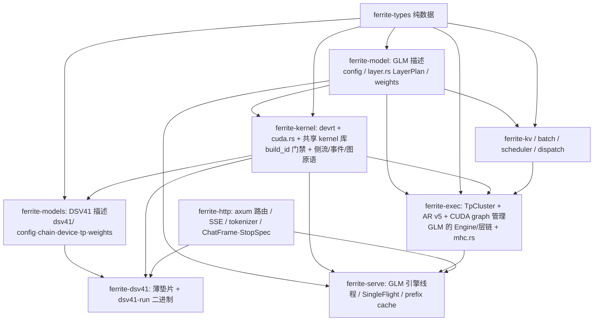

# Ferrite 统一推理引擎 — 最终架构蓝图

**一句话**：一个 engine、N 个模型。运行时（设备层 / 引擎契约 / serve 栈）全部共享；模型只保留「算子 + 层链 + 权重布局」，且这三者进一步下沉为**数据**（层描述列表）——数学差异由数据表达，不是代码分叉。

> **维护状态（2026-09-11 更新）**：本次审查把 DSV41 会话新落地的 6 类基建（fork/join 侧流、PDL 串链、生产者直出融合、AR v5 grid 修复、decline 码 2 约定、a32/占用率审计）抽象成**统一蓝图的一等公民**（§4），并给出 GLM 侧缺口对照（§5）。§1 的分层图按各 `Cargo.toml` 实际依赖重画；§3 的迁移表按实际完成度更新；§6 的性能数字按 v3 清单口径替换过时读数。

---

## 1. 分层图

箭头 = 依赖方向（基于各 `Cargo.toml` 实际边，2026-09-11 复核）：



- **ferrite-kernel** —— 唯一设备层。`devrt`（dlopen、字节级不池化分配、H2D/D2D/peer 拷贝、**侧流/事件/图原语**、捕获原语）+ `cuda.rs`（`CudaBackend`/Tensor，GLM 的 link-time 设备层）+ `dcp`（分页/稀疏注意力原语）。`build.rs` 把 `.build_id` 烤进二进制，加载时与 `.so` 的 `ferrite_kernel_build_id()` 对拍，不匹配即拒载（三道加载门禁见 `AGENTS.md`）。
- **ferrite-model**（单数）—— **GLM 的描述层**：`config.rs`（`Glm53FlashConfig`，45 层）、`layer.rs` 的 `LayerPlan{layer_idx, attn, mlp}` + `build_layer_plans()`（层角色在 build 期决定的雏形）、权重布局。GLM 的**运行时**在 `ferrite-exec`（`Engine`/`tp.rs` 5509 行 + `mhc.rs`）。
- **ferrite-models**（复数）—— **DSV41 的描述层**：`dsv41/`（config/quant/engram/ops/chain/chain_dev/device/tp/weights/vision）。`device.rs`/`tp.rs` 的通用内脏已转发 `devrt` / `ferrite_p2p_ar_v5`；剩余的是 DSV4 kernel ABI 表 + per-rank staging 参数，随模型走。
- **ferrite-exec** —— 引擎契约与集群：`TpCluster`、AR v5 epoch 协议（唯一活的 P2P 交换）、mega-graph 链、`StepEngine` 形状、GLM 的层链与 MHC（`mhc.rs`）。
- **ferrite-serve / ferrite-http** —— GLM 路径目前是 `ferrite-serve`（`--model-dir <GLM 权重>`）；DSV41 路径目前是 `ferrite-dsv41` 的 `dsv41-run` 垫片二进制。**「单一二进制 `--model {glm53,dsv41}`」是 Phase 5b 的目标，尚未完成**。模型差异只经 `StopSpec`（停词集）与 `ChatFrame`（chat 模板）注入，seam 已就绪。

## 2. 核心抽象

**模型 = 层描述列表**。`ferrite-model/src/layer.rs:22` 的 `LayerPlan{layer_idx, attn, mlp}` + `build_layer_plans()`（`:44`）是雏形：层角色在 build 期决定，forward 期不再分叉。终态扩展为：

```rust
struct LayerDesc { kernels: &[KernelId], weights: &[WeightSpec], shard: ShardRule }
fn layer_descs(cfg) -> Vec<LayerDesc>
```

DSV4.1 的每层三段（A: hc→attn；**AR#1**；B: hc→moe；**AR#2**；C: hc_post）与 GLM 的 45 层 linear/DSA 混合，都只是不同的**描述数据**。

**引擎 = 图构建器**：`layer_descs` → 构造期预分配缓冲 → 捕获 CUDA graph 节点。所有 launch 参数必须**设备化**（`window_idxs`/`compress_commit`/`ring_append` 即为此生），图才能跨请求复用；当前 `reset` 丢 exec 是权宜，正解是构造期一次性分配、地址进程内稳定。

## 3. 迁移路线（按实际完成度更新）

| Phase | 内容 | 状态 | 依据 |
|---|---|---|---|
| 0 | build_id / argmax·gather·scatter / graph 原语统一 | ✅ 完成 | 补丁已在主线 |
| 1 | 消灭 dsv41 的 `tp.rs`：改调 ferrite-exec 的 v5 AR + graph 管理 | ✅ AR 换共享完成；engine 契约待 Phase 5 | `dsv41-onto-shared-engine.md` Phase 2 |
| 2 | kernel 库合并：`dsv41_*.cu` 并入共享库 | ⬜ 未做（各有自己的 `.so`/build_id；PDL/AR 已证明「同 TU 不可共享」的边界） | — |
| 3 | 模型描述化：`chain_dev.rs` 层循环 → 声明式 `LayerDesc` | ⬜ 未做（`LayerPlan` 是雏形） | `ferrite-model/src/layer.rs` |
| 3b | **段级 persistent 核**（`LayerDesc` 的更高融合档位：40×3 段核，AR = 段边界） | 🔬 设计完成、P1d 实测回归（+3.3ms，默认 OFF） | `dsv41-persistent-arch.md` |
| 5a | 模型定义搬进共享 `crates/ferrite-models` | ✅ 完成（`ferrite-dsv41` 变 25 行 re-export 垫片） | `crates/ferrite-dsv41/src/lib.rs` |
| 5b | 单一二进制 `ferrite-serve --model dsv41` | ⬜ 未做（`dsv41-run` 仍是独立二进制） | `ferrite-serve/src/main.rs` |
| 4 | 两个设备层收敛：`cuda.rs`（GLM）与 `devrt`（DSV41）合一 | ⬜ 待办（见 §5 的缺口表——这也是 GLM 拿不到侧流/节点优先级的结构性原因） | `dsv41-onto-shared-engine.md` §Phase 3 |

**纪律（hc-merge 教训）**：单核 + ticket 自旋 = **+3.2ms 回归**——不要为「少一个 kernel」把跨 rank 同步塞进核内。AR 是两处物理边界（每层 20KB），严格「每层 1 算子」不存在，可行形态是**每层 3 段**。

---

## 4. 本会话（2026-09-11）新基建 → 统一抽象候选

> 本节是本次更新的主体：把 DSV41 会话验证过的 6 类模式整理成**跨模型可复用的统一抽象**，并标注提升路径。凡标注「待上机 A/B」的，是本次会话在本机（无 nvcc/GPU）实现、尚未有生产读数的项。
>
> 📖 **同批模式的「怎么做」手册见 `dsv41-methodology.md`**（成功模式 A-E + 反模式 6.1-6.5 + 判定纪律 + 工具索引）；
> 本节是架构视角（是什么、放在哪一层），该文件是操作视角（怎么复用、怎么不踩坑）。

### 4.1 fork/join 侧流模式 —— 层内并行的统一原语（本会话最大方法论收获）

**模式**：把一层里两条**互不读写**的子链拆到不同 CUDA stream，用 `cudaEventRecord` + `cudaStreamWaitEvent` 做 fork/join。三条硬性质：

1. **不改 grid 形态**——只改发射流，kernel 与操作数逐字不变 ⇒ **位级一致**；
2. **无跨块/跨 rank 同步**——不引入任何核内栅栏或自旋（对比 hc-merge 的 +3.2ms 反面教材）；
3. **纯事件驱动 + 图可捕获**——`cudaEventDisableTiming` 事件在捕获区内合法，`fork_ev`/`join_ev` 可在图内按程序序复用（`DSV41_HC_TAIL_SPLIT` 每步 40×/捕获复用同一对事件）。

**基础设施（共享，已在 `ferrite-kernel`，GLM 可直接用）**：
`devrt.rs` 的 `create_side_stream`（`:144`，`cudaStreamCreateWithPriority` + `cudaStreamNonBlocking`）、`side_stream()`（`:765`）、`side_stream2()`（`:790`）、`side_stream3()`（`:840`）、`record_event`（`:862`）、`stream_wait_event`（`:873`）、事件 `fork/join`（`:796`/`:803`）、`in/early`（`:812`/`:819`）、`fork2/join2`（`:826`/`:833`）、`fork3/join3`（`:847`/`:855`），以及 `SidePrio` 解析（`parse_side_prio`，`:126`）。

**本会话的 6 个胜利（全部 default ON，`chain_dev.rs` 各有独立 env gate 可回退）**：

| # | 名称 | 拆出的两条链 | fork 点 | join 点 | gate / 状态 |
|---|---|---|---|---|---|
| 1 | **hc tail split** | EARLY（collapse+rmsnorm+fp8，~1.7µs）vs LATE（ss+mixes+sinkhorn+comb，~10.7µs） | `hc_front_split` 内（C 侧） | 主流 hc_post 前 | `DSV41_HC_TAIL_SPLIT`（`chain_dev.rs:2238`）；第 41 轮实测仅 −0.20ms（理论 −0.86） |
| 2 | **EARLY-on-side**（hc-early-opt） | EARLY 落到侧流头部，后面的 dots/LATE 与投影链重叠 | side 链头（`fork_ev` 输入就绪边之后） | `fork_ev` 的第二次 record（`hc_front_split` 内等） | 复用 `DSV41_HC_TAIL_SPLIT`；B（EARLY 回主流）A/B 实测 +0.27ms ⇒ **2026-09-11 已回滚**（B 删掉的 `in_ev`/`early_ev` 不再恢复，两条边改由 `fork_ev` 承担） |
| 3 | **dots-on-side** | dots 也上侧流（只写 `g_hc_part`，唯一读者是 LATE） | side（EARLY 之后） | 流内顺序即 happens-before；`join_ev` 交模型侧 `hc_tail_join` | 复用 `DSV41_HC_TAIL_SPLIT`；main 的 front 代价从 dots(4.9µs) 降到 EARLY(1.7µs) |
| 4 | **attention dual-chain** | q 链（norm/lin_rope+wq_b+rope，~13.5µs，关键路径）vs kv 链（rmsnorm_rope，~10.6µs，填充） | `lin2` 之后 | kv 链之后、`ring_win_fuse` **之前**（不是 sparse_attn——ring append 立即读 `s.kv`） | `DSV41_DUAL_CHAIN`（`chain_dev.rs:312`）；收益 ≈ −0.10ms（v3 实测 rmsnorm_rope 2.5µs×40） |
| 5 | **MoE dual** | routed experts 链（~42µs）vs shared expert 链（~22µs） | `moe()` 顶部（`sh_w` 后、gate 前） | routed 之后 join，再 `add_inplace(&s.o,&s.ex_out)` | `DSV41_MOE_DUAL`（`chain_dev.rs:365`）；⚠️ 强约束见下 |
| 6 | **compress side** | kv-source 层（2/8/14/20）的 4 个 compress launch（~30µs） | `lin2` 之后（与 dual_chain fork 同点） | `window_idxs` 之后、**indexer 之前**（indexer 读本层 `latent` 与 `clen`） | `DSV41_COMPRESS_SIDE`（`chain_dev.rs:338`）；需**新开 `side_stream3`**（与 kv 链时间窗完全重叠） |
| 7 | **dots+LATE 合并**（hc-dl-merge，2026-09-11） | 不是拆链，而是把 side 链的 dots(4.9µs)+LATE(10.7µs) **两个节点合成一个**：`hc_dots_late_kernel`（`dsv41_kernels.cu:6632`）用 `atomicAdd` 选举**最后一个 publish 的 dot 块**跑 LATE 半（`hc_pre_persist_mb_kernel` 的无自旋模式） | —（side 链内部） | 不变（`hc_tail_join` wait `join_ev`） | `DSV41_HC_DL_MERGE`（默认 ON，`=0` 回两 launch）；EARLY 保持侧流头部独立 launch（EARLY+LATE 合并已证不可行：main 等待 1.7µs→17µs）；逐位等价（split=1 + tail 走 `ss_in==1`）|

**必须遵守的三条坑（从 6 个实现里提炼的通用规则）**：

- ⚠️ **fork 点必须在 main 上游的写之后**。side 链若读主流上游写的缓冲（`s.h`/`pre_collapse`），必须补一条 `main→side` 的 `in_ev` 边；否则该 kernel 会变成图 ROOT、抢在生产者之前读到陈旧值（整步 capture `DSV41_GRAPH_STEP` 默认 ON，图内无隐式顺序）。
- ⚠️ **join 点 = 最早消费者之前，不是直觉位置**。compress 的 join 在 `indexer` 之前（连 `sparse_attn` 之前都不够）；attention dual-chain 的 join 在 `ring_append` 之前（不是 `sparse_attn`——ring append 立即读 `s.kv`）。**先找到真正的首个消费者，再定 join。**
- ⚠️ **时间窗重叠的链必须各占一条 side stream**。kv 链与 compress 都落在 `lin2`→消费者之间，共用会把 10.6µs 串到 30µs 后面；hc LATE 在 `lin2` 之前就已 fork，也不能与 attention dual-chain 共用 `side_stream2`。**当前三类窗口 = 三条流（+ 主），这是几何决定的最小配置。**

**多流优先级（同属这一抽象）**：优先级只在**图回放**且节点 READY 时决定谁先拿 SM，机制是 `cudaGraphInstantiateFlagUseNodePriority`（`devrt.rs:1391`，flags 在 `:636` 构造；当且仅当**任一**侧流优先级非默认才开启，`:633` 的 `DSV41_GRAPH_NODE_PRIORITY` 是总开关）。

- `DSV41_HC_TAIL_PRIO`（默认 **greatest**，LATE ~10.7µs / 窗口 ~50µs）——**疑似过度分配**（39µs 余量下优先级无收益，反抢投影 wave 的 SM）。
- `DSV41_DUAL_PRIO`（默认 **default**，kv ~10.6µs vs q 13.5µs；MoE shared ~22µs vs routed ~42µs）——两条链都在主流自己的串行路径上，压主流不划算。
- `DSV41_COMPRESS_PRIO`（默认 **greatest**，~30µs 且汇合点最晚）——三条侧流里唯一真正 gate 住 attention 的链。
- 唯一证据：stderr 的 `[hc_tail]/[dual_chain]/[compress_side] side stream priority = N`；否则优先级可能没进 capture。

### 4.2 PDL 串链 —— 跨核依赖的「零图节点」表达

**模式**：`cudaLaunchAttributeProgrammaticStreamSerialization` 让 consumer grid 在 producer 的 ramp-down 期间启动，靠 consumer 端 `cudaGridDependencySynchronize()` 自己等数据（`__CUDA_ARCH__ >= 900` 守卫）。**只在 consumer 端加 attribute，producer 端不动。**

**现状（GLM 与 DSV41 各一套，因 file-static 不能跨 TU 共享）**：

| 副本 | 位置 | gate / 默认 | 覆盖 |
|---|---|---|---|
| GLM | `ferrite_kernels.cu:753` `pdl_or_plain` | `FERRITE_PDL` / **OFF** | ~4 launcher（`sparse_attn_v2`、`hc_post`、`gemv_bf16_v2` 族、`gemv_tri`）；实测**中性**（`AGENTS.md:942`，且当时覆盖面窄） |
| DSV41 attn | `dsv41_kernels.cu:2665` `dsv41_pdl_or_plain` | `DSV41_PDL` / **ON**（`=0` 回退走 `cudaLaunchKernel`） | attention 投影链 consumer 端 **8 个 launch 点** |
| DSV41 expert | `dsv41_experts_mxf4.cu:873` `dsv41_experts_pdl_or_plain` | `DSV41_PDL` / **ON** | `quant_fp4 → gateup → down_reduce` 共 **3 个 launch 点** |

- ⚠️ **每个新 TU 要带自己的副本**：`pdl_or_plain` 是 file-static，`dsv41_kernels.cu` / `dsv41_experts_mxf4.cu` / `ferrite_kernels.cu` 各有一份逐条同义的实现。新增 `.cu` 若要用 PDL，必须复制一份，不能链到别处。
- ⚠️ **producer 端不加 attribute**：`quant_fp4_fused_kernel` 刻意**不加**——它对紧邻 producer（`gemv_bf16_route` 写的 `scores`/`route_idx`/`route_w`）无数据依赖，但提前启动会削弱 `route_idx` 对 gateup 的传递可见性。若在 quant 入口加 sync 则安全但收益仅节点间隙。
- ⚠️ **未上机验证**：DSV41 侧 11 个 PDL 点均在本机（无 nvcc）实现，上线前必须做 `DSV41_PDL=0/1` 图 A/B —— 入口 `scripts/dsv41_recovery_verify.sh` phase 3b（`PHASES="3b"`，两臂钉同一 a32 配置；文本逐字相同为主判据，p50 为次）。
- 与 `§4.1` 的关系：PDL 是**串行链**上省节点间隙，侧流是**并行链**上抢窗口；二者正交，可叠加。
- ⚠️ **不要把 PDL 当 launch 开销的解药**：GLM 的 2026-09-10 实验已证「1.2ms 间隙是数据依赖等待 + kernel 尾部效应，不是 launch 开销」——PDL 只覆盖 ramp-down 那一小段。

### 4.3 生产者直出融合（T1 模式）—— 消掉 global 中间量往返

**模式**：把 producer 的**尾段**（rmsnorm / quant / rope / epilogue）搬进 consumer 的 **prologue 或 epilogue**，让中间量不写回 global 再读。这是「每层 3 段」融合的**最小可运行单元**，也是段核（§3 Phase 3b）的第一步原型。

**本会话已落地的实例（全部 `DSV41_*` gate，多数 default ON）**：

| 实例 | 融合点 | 消掉的 launch | 关键约束 |
|---|---|---|---|
| `DSV41_NORM_FUSE` | `rmsnorm_q + fp8 encode` 搬进 `wq_b` 的 gemv **prologue** | 40 次 `rmsnorm_q`（0.13ms） | 强制 32 warps/block（归约树要与 1024 线程逐位对齐）；mode 强制 4；**`qr` 保持 RAW**（downstream 必须走同一融合 launch） |
| `DSV41_OROPE_Q` | o-rope 后**追加一趟**整行量化（`dsv41_apply_rope_q`） | 40 次 `quant1` | 必须是 barrier 之后的第二趟（rope 循环只碰每 head 尾部 `rope_head_dim` 列；量化块是整行 `nlh*hd`） |
| `DSV41_ROPE_FUSE` | q/idx_q rope 折进 GEMV epilogue（`dsv41_gemm_fp8_mx_rope` / `_mx2_rope`） | 40(q) + ~7(idx_q) | 强制 32 warps/block、grid=n/32；launcher 校验形状，不过返回 decline |
| `DSV41_WOB_F32` | wo_b 直读 f32 激活（`dsv41_gemm_fp8_mx_f32`） | 每步 40 次 `quant1` | **只改数据路径、不改 grid 形态**（block 仍是常规 g_gemv_warps）；非逐位（跳过量化往返、精度更高）⇒ 必须 parity |
| `DSV41_SWIGLU_Q` | swiglu 直出 `(xq,xsc)` | `quant_kernel` 40 次 | 逐位（`tests_dsv41_glue.cu` 的 swiglu_q 用例） |
| `DSV41_SWIGLU_FOLD` | **共享专家** swiglu + fp8 encode 搬进 w2 GEMV 的 **prologue**（`dsv41_gemm_fp8_mx_swiglu`）| 40 次 `swiglu_limit_q`（1.7µs/次）+ 一个图节点 | NORM_FUSE 同构；**不强制 32 warps**（参考 amax 是 per-warp 的 32-lane 树，无跨 warp 归约），保留 `dsv41_gemv_warps_for(n)` ⇒ 整个 launch 逐位等价于 `(swiglu_limit_q, gemm_fp8_mx)`；mode 强制 4；`ex_act` 是唯一输入（不再回写 f32）；`epi_add` 同时承载 A5 合并。只覆盖**共享专家**，routed 侧由 `DSV41_GATEUP_FUSE` 负责 |
| `DSV41_GATEUP_FUSE` / `DSV41_DOWN_FUSE` | expert 出口 2·inter→inter + swiglu epilogue；down+reduce 合一 | `swiglu_limit_batched` / `moe_down_reduce` | 逐位（K 循环照抄 / `__fadd_rn`/`__fmul_rn` 显式分开 / slot 升序累加） |
| `DSV41_MOE_EPI_ADD` | `add_inplace` 折进 lane-0 epilogue | 80 节点 | 结合律不变 ⇒ 逐位 |
| `DSV41_COMP_PLACEHOLDER_FUSE` | placeholder 折进 `ring_win_fuse` epilogue | 30 次 launch/节点 | `clen==nullptr` 时与基础版逐字节相同 |
| engram wkv f32 直读 | 复用 `dsv41_gemm_fp8_mx_f32` | 2 次/步 `quant_fp8` | 读的是 **AR 之后**的 f32 行（AR 前发射 fp8 会违反 `fp8(Σ) ≠ Σ fp8`） |

**两条铁律（从失败案例提炼）**：

- ⚠️ **融合不能改变 grid 形态**。B1 把量化做进 wo_a epilogue，被迫 32 warps/block ⇒ grid=n/32、148→32 活跃 SM，实测 **+0.24ms**。正确形态是「只改数据路径」——block 形状与普通 GEMV 相同，无 SM 利用率损失。
- ⚠️ **FFI 参数顺序是手写转录，编译器不会对着 `.cu` 校验**。`DSV41_ROPE_FUSE` 曾因把 `CuStream` 放在第 9 位（照抄带 C++ 默认尾参的 `dsv41_gemm_fp8_mx`）而让 C 侧整体错位一格 → `rope_rd <= 0` → decline → **静默回退**（表现为「gate 默认 ON、符号探测为真、kernel 实现正确，但 nsys 里 `apply_rope` 仍是 88/步」）。本仓库主流约定是 **stream 放最后**，只有带 C++ 默认尾参的旧符号例外。新符号的 FFI 类型必须逐参对照 C 原型。
- ⚠️ **跳过量化往返 = 精度更高但非逐位**。凡是「直读 f32 / 跳过 quantize→dequantize」的融合，上机必须做一次 parity（同二进制 A/B 的 text/fingerprint 对比），不能只在无 GPU 环境做 `cargo check`。

### 4.4 AR v5 的 grid 修复 —— 占用率审计的标准案例

**问题**：AR v5 三个 launcher（`ferrite_p2p_ar_v5`:8427 / `ferrite_p2p_ar_pubred_v5`:8495 / `ferrite_p2p_ar_v5_hcpost`:8652）旧映射是 `ceil(n/1024) × 1024 线程`，`i4 = blockIdx*1024 + tid, step = 5120`。n=5120 ⇒ n4=1280 ⇒ **block0 干 80%、block1 干 20%、block2-4 全空**，8192 次 load 压在单 SM。

**修复**：改成 `threads = 256`（`world > 256` 时回退 1024——stamp/poll 要求 `blockDim.x >= world`）+ `blocks = ceil(n4/threads)` ⇒ n=5120 得 **5 个满块 × 256 线程 = 1280 线程**，每线程恰好 1 float4 × world rank，摊在 5 个 SM。**逐位等价**（i4 所有权与升序 rank 求和序未变、无跨线程归约）。store kernel 同映射同改。预期 **−0.12~0.16ms**。

**方法论**：这是「**grid 失衡 ≠ 协议成本**」的教科书。AR 的 0.66ms 是 NVLink 协议地板（store 的 160KB 远程写 + stamp 传播）；reduce 那 1.5-2µs 是**本地读 + grid 失衡**，不是 NVLink 项。诊断时先问「是数据量、还是并行度」，再看 grid 映射。

### 4.5 decline 码 = 2 的约定 —— 融合 launcher 的错误码契约

**背景**：`cudaErrorInvalidValue == 1`，而多个融合 launcher 用 `return 1` 表示「形状不支持，请回退」。两个方向的撞车：

1. **误判为回退**：C 侧真实错误恰好是 1 时，Rust 的 `rc == 1` 把它当优雅 decline 静默吞掉；launcher 若不清 sticky，错误还会**泄漏到下一个 launcher** 并让 serve 崩。
2. **误判为硬错**：Rust 写 `rc == 2` 而 C 侧仍 `return 1` ⇒ 真 decline 被当错误抛出 ⇒ 融合路径永远不生效。

**统一约定（跨模型规范）**：

- **新符号的 decline 哨兵一律用 `2`，永不用 `1`**：C 侧 `return 2;` ↔ Rust 侧 `if rc == 2 { Ok(false) }`。
- **非 `cudaGetLastError()` 来源的 CUDA 调用**（`cudaEventRecord`、`cudaStreamWaitEvent`、`cudaFuncSetAttribute`、`cudaMalloc` …）在返回错误码前**必须先 `(void)cudaGetLastError()` 清 sticky**，否则错误泄漏给下一个 launcher 造成**归因错位**（r42 的 SetAttribute sticky-leak、r44 的 hc_front_split 事件失败都是这一类）。
- **旧符号保持 `1`**（`apply_rope_q`/`rmsnorm_q`/`swiglu_limit_q`/`gemm_fp8_mx`/`gemm_bf16_fp8x2`/`argmax_sliced`/`p2p_ar_v5_hcpost`/`hc_front*`），仅在源码注释标注隐患；**重新启用任何旧符号前，先把它迁到 2**，否则 sticky-leak 崩溃会复现。
- 全量审计表见 `dsv41-layer-fusion.md §7.1`；r44 的事件清错补丁见 `§7.2`。

### 4.6 a32 / 占用率审计方法论 —— 把「估算」变「实测」

**对象**：`gemm_fp8_gemv_kernel` 的 M=1 路径带一张 block 级预解码激活表 `s_af`（"a32"，`k×f32` = 20KB @ k=5120），把 smem 从 ~28KB 抬到 ~47.4KB（mode 4 的 `gsmem` = 48512B @ warps=4/k=5120），即 **blocks/SM 4 → 8**。独立门 `DSV41_GEMV_A32`（`dsv41_kernels.cu:2597` 的 `g_gemv_a32`，`:2602` 的 `dsv41_gemv_a32_bytes`），默认保留；`=0` 丢弃 a32、把 decode+scale 内联回消费循环，**逐位等价**，smem 少 20KB。

**P1 a32 死槽消除（2026-09-11 已落地）**：a32=1 时 mode 4 的 k 字节激活 staging `s_a` 只剩一个读者（`s_af` 的物化循环）⇒ 把 uint4 拷贝 + 逐字节解码合成一趟直写 `s_af`，`s_a` 槽仅在需要时分配（内核 `a32_direct` + launcher `dsv41_gemv_sa_bytes`）。k=5120/warps=4 时 mode 4 的 gsmem **48512 → 43392B**，blocks/SM 4 → 5。详见 `dsv41-kernel-inventory-v3.md` §待实测清单 0。

**P1 第二处（2026-09-11 已落地）**：`gemv_bf16_fp8x2_kernel`（`dsv41_gemm_bf16_fp8x2`）同法处理。该核无 a32 门/参数（消费循环无条件读 `s_af` ⇒ a32 恒 ON），合并无条件：kernel `s_lut` 基址改 `s_w + nwarps*k`、删 staging、物化改 global uint4 → LUT → 直写 `s_af`；launcher gsmem 去掉 `(vec==4) ? (warps+1)*k` 的额外行 ⇒ 默认形状 **47104 → 41984B**。

**方法论（可复用）**：

- 用 `cudaOccupancyMaxActiveBlocksPerMultiprocessor` + `ptxas -v` 把「smem 预算 → blocks/SM → wave」从**估算**变成**实测**。工程里已有探针：`dsv41_a32_bench.cu`（经 `dsv41_gemv_gsmem`/`dsv41_gemv_occupancy` 两个 host 探针打印每 shape 的 smem/blocks-per-SM/µs）+ `scripts/dsv41_a32_bench.sh` + `scripts/dsv41_recovery_verify.sh`。
- **命名陷阱**：`DSV41_GEMV_FP8_MODE=3` **不是** a32 开关（mode 3 也物化 `s_af`）；a32 的独立门是 `DSV41_GEMV_A32`。
- ⚠️ **smem 余量极紧**：mode 4 只剩 49152 − 48384 = **768 B**。任何给 mode 4 加 smem 的改动都会越过 48 KB 门槛而触发 `cudaFuncSetAttribute`，必须一并复核 launcher。
- ⚠️ **反例：不要迷信「占用率悬崖」**。`01291b2` 的 nv8 曾以「+14 寄存器 ⇒ 6→4 blocks/SM ⇒ 1.5 wave ⇒ +49%」定案，但后续隔离微基准（4 值 uint16 无 `launch_bounds`、56 regs/4 blocks）是**全场最快** ⇒ 「regs → blocks/SM → wave」不是唯一解释。**占用率假设必须被实测证伪/证实，不能跨核外推**（`dsv41-kernel-inventory-v3.md` §(B)/(B-修正)）。
- 相关的排除项：`gemm_fp8_gemv` 的 14→22 参数**不是** +8.7ms 的原因（实测寄存器 48→40 反而降、0 spill、occupancy 不变），退化来自 **launch 次数**（`moe_batch=false` 误关导致 +560 launch/步）。

---

## 5. GLM 现状 vs DSV41 基建对照（gap 表）

> 数据来源：`crates/ferrite-exec/`（GLM 运行时）、`crates/ferrite-kernel/src/cuda.rs`（GLM 设备层）、`crates/ferrite-model/`（GLM 描述层）、`kernels/cuda/ferrite_kernels.cu`（GLM 共享 kernel 库）。「GLM 侧」指 45 层 GLM-5.3-Flash 的生产路径。

| 基建 | DSV41 | GLM | 差距的性质 / 提升路径 |
|---|---|---|---|
| **fork/join 侧流原语** | ✓ `devrt` 侧流/事件全套 + 三流六链 default ON | ✗ **完全没有**（`cuda.rs` 里无 `side_stream`/`create_side_stream`） | **共享侧已就绪，缺的是 GLM 引擎接入**。GLM 的层链在 `ferrite-exec/tp.rs`，其 kernel 发射走 `cuda.rs`（link-time `CudaBackend`），而 `devrt` 是 dlopen 的另一套设备层（Phase 4 收敛前是两个世界）。**这是最高价值的迁移项**：GLM 的 hc 链（MHC）与 MoE shared expert 是最明显的候选窗口。 |
| **多流优先级 + 图节点优先级** | ✓ `DSV41_HC_TAIL_PRIO`/`DUAL_PRIO`/`COMPRESS_PRIO` + `UseNodePriority` | ✗ | 机制在 `devrt.rs`（`graph_instantiate_flags`）；GLM 的图实例化走 `cuda.rs`/`ferrite_graph_instantiate`，未接该 flag。**随 Phase 4 设备层收敛一起做。** |
| **PDL 串链** | ✓ default ON，11 个 launch 点（attn 8 + expert 3） | ⚠️ 有 `pdl_or_plain`，但 default OFF、仅 ~4 launcher、实测中性 | GLM 的覆盖面太窄且从未在「consumer 端显式 sync」的正确形态下重测。**可扩到 MoE（quant→gateup→down）、hc、投影族**；新 `.cu` 要自带副本。 |
| **生产者直出融合** | ✓ 十余处（§4.3） | ⚠️ 部分：`gdn_step_v2`、**hc_pre big-fuse（TileLang 单核全内联 sinkhorn，−0.25ms 已 ON）**、`gemv_bf16_v2` 的 `gv2_route_epilogue`（M=1 末块融合 route）、`moe_fused_act/down` 族、`FERRITE_GEMM3` cast 消除 | GLM 已有**同类思想**（big-fuse / last-block epilogue），但**不像 DSV41 那样有系统化的 prologue/epilogue 融合清单**。可复用的抽象 = 「把 producer 尾段搬进 consumer 首/尾，且不改 grid 形态」。 |
| **AR v5** | ✓ 用共享实现 | ✓ 蓝本（单入口融合） | **已统一**（Phase 2）。grid 修复（§4.4）两个模型共享同一组 launcher。 |
| **decline 码 = 2 约定** | ✓ 全量审计（§7） | n/a（GLM 的融合多在 CU 内，少见跨 launcher decline） | 应写成**跨模型规范**：任何新增带 decline 的 launcher 都遵守；非 `cudaGetLastError()` 调用一律清 sticky。 |
| **a32 / 占用率审计工具** | ✓ `dsv41_a32_bench.cu` + 两个 host 探针 + 脚本 | ⚠️ 手动（`cudaOccupancyMaxActiveBlocks...` / `ptxas -v` 各自临时用） | 探针/脚本可泛化成模型无关工具，供两个模型的 smem/regs 预算分析复用。 |
| **段级 persistent（3 段核）** | 🔬 设计完成，P1d 回归，默认 OFF | ✗ | `LayerDesc` 描述化的共同产物（§3 Phase 3b）；两个模型共享同一「图构建器」。 |

**一句话结论**：DSV41 会话最大的**结构性**收获不是某个 kernel，而是**「层内并行不一定要动 kernel，只要动发射流」**这一范式——它把「融合」从「重写计算」降级为「重排发射」，因而天然位级一致、天然可回退、天然跨模型。GLM 的缺口**不在能力，而在设备层未收敛**：`devrt` 的侧流/事件/节点优先级原语已经写好，只等 `cuda.rs` 与 `devrt` 在 Phase 4 合一。

---

## 6. 200 tok/s 的路径

**短期（B=1，增量）**：本会话全部优化（shared expert TP、e4m3 LUT、a32、T1 norm epilogue、lm_head v5 epoch 切分、dots128、sparse 3-deep、indexer 两步、P1/P2 快赢、cast 消除）已把单步从 13.28 压到 **~9.6ms（v3 清单生产口径）/ 9.57ms（serve 交叉验证）**，约 98–105 tok/s（口径见 `dsv41-kernel-inventory-v3.md` §0/§3——**不要**再用旧文档的 10.16ms）。9.6→5ms 的 2x 无法靠逐 kernel 抠：`gemm_fp8_gemv` 的 91% 是固定项、残差 ~1.15ms 是 ~700 节点的 ramp-down。剩余快赢 = **§4.1–4.3 六类基建的待上机 A/B**（侧流 ×6、PDL ×11、直出融合十余处、AR grid 修复、a32）。

**中期（persistent / mega-kernel）**：5ms 需**跨层流水 + 激活常驻 smem**——一个 persistent kernel 吃下连续多层，层间激活不落 global；AR#1/#2 作为段边界仍在（跨 rank 无法进核内），用 **PDL 重叠（§4.2）** 或 **侧流（§4.1）** 重叠下一段。段核 = 「phase machine」，40 层 × 3 段 = 120 节点（vs ~700）；hc 族沿 hc_dim 分 tile（T=64 → 320 blocks）。⚠️ P1d 的回归（+3.3ms）已证「多块相位机 + 选举式自同步」在图的约束下会退化——正解是**无同步的角色分解或 PDL**，不是 `cudaLaunchCooperativeKernel`（与图捕获不兼容）。架构级改动，须先有图 + 描述化（Phase 3）打底。

**长期（M>1 batching + prefix cache）**：通往**多并发 1600 tok/s**。延迟受限已证（8→16 seq 只 +7%），故 batching 有 2x 余量。`ferrite-kernel::dcp` 的 `split_pages_round_robin`/`sparse_attn_partial` + kv-page-design（P=128 token/page、链式哈希、DSA latent+index_k 页化、TP8 全复制无协商）是共享 prefix cache 的页基座；`ferrite-batch/scheduler/dispatch` 供调度与 radix 前缀树。叠加：单并发 5ms ≈ 200 tok/s，16 并发共享前缀 → 1600 tok/s。

## 7. 里程碑判据

1. 一个二进制、两个模型、零 fork 共享栈（Phase 4 设备层 + Phase 5b 单一二进制）；
2. B=1 ≤5ms（persistent）或 M=16 ≥1600 tok/s（batching），任一达成即「世界最优」候选；
3. 每步改动：同二进制背靠背 A/B + 人眼文本；禁止 git revert，禁止「变快 = 少算」；
4. **新基础设施的三条验收线**（本会话新增）：① 侧流/PDL/直出融合必须**位级或 parity 验证**；② 每项一个 env gate、默认可回退；③ 上机前必须 `DSV41_*=0/1` 图 A/B，且 stderr 的 side-stream priority 日志是优先级真的进了 capture 的唯一证据。

---

_事实来源（2026-09-11 复核）：`crates/*/Cargo.toml`（分层图）；`ferrite-kernel/src/devrt.rs:126/144/636/765/790/840/862/873/1391`（侧流/事件/节点优先级）；`ferrite-model/src/layer.rs:22/44`（LayerPlan）；`ferrite-models/src/dsv41/chain_dev.rs:296/312/315/338/341/365/2238`（六个侧流 gate）；`dsv41-kernels.cu:2581/2665`、`dsv41_experts_mxf4.cu:873`、`ferrite_kernels.cu:753/8427/8495/8652`（PDL/AR/grid）；`dsv41-layer-fusion.md`（§6 融合清单、§7 decline 审计）；`dsv41-persistent-arch.md`（段核/PDL/gap）；`dsv41-kernel-inventory-v3.md`（口径/占用率/AR 交叉验证）；`dsv41-onto-shared-engine.md`（Phase 完成度）；`crates/ferrite-dsv41/src/lib.rs`（垫片）；`crates/ferrite-exec/{lib.rs,tp.rs,mhc.rs}`、`ferrite-kernel/src/cuda.rs`（GLM 现状）。_
